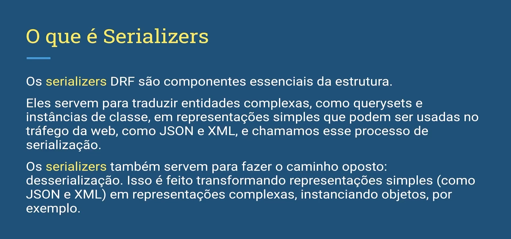

# Protocolo REST API - BRANCH tests-units-view-set-serializers   

## REST API 

```txt
O Protocolo REST (Representational State Transfer) é um estilo arquitetural amplamente utilizado para projetar redes de comunicação na web. Ele define um conjunto de restrições e princípios para o design de serviços web que são simples, escaláveis e eficientes.

Uma API RESTful (Application Programming Interface) é uma interface de programação de aplicativos que segue os princípios do REST. Isso significa que ela usa os métodos HTTP (GET, POST, PUT, DELETE, etc.) para acessar e manipular recursos, utilizando URLs para identificar esses recursos.

As APIs RESTful são populares devido à sua simplicidade, flexibilidade e facilidade de escalabilidade. Elas são amplamente adotadas para o desenvolvimento de aplicativos web, serviços web e integração de sistemas, permitindo a comunicação entre diferentes sistemas de forma eficiente e interoperável.
```

**Fonte: CHATGPT 3.5**

## O que é Serializers

